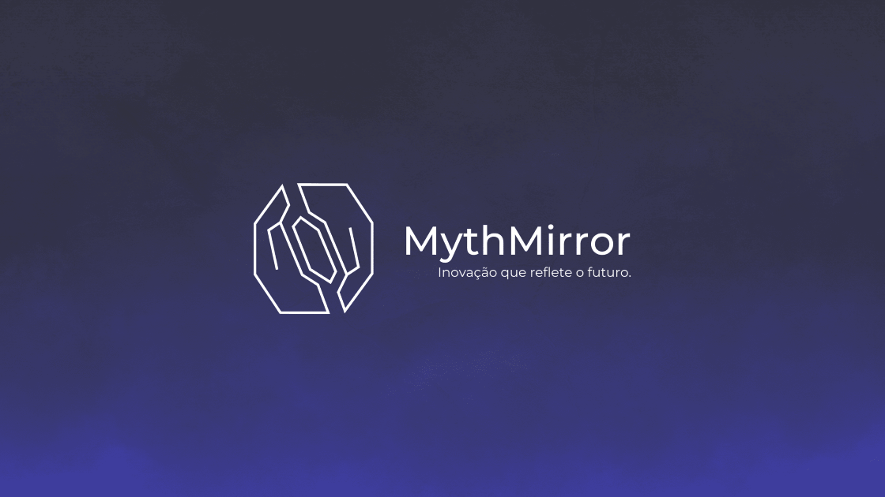

<p align="center">
  <a href="https://nextjs.org/"></a>
  <a href="https://www.typescriptlang.org/"></a>
  <a href="https://tailwindcss.com/"></a>
  <a href="https://www.brevo.com/"></a>
  <a href="https://opensource.org/licenses/MIT"></a>
</p>

# 🌌 MythMirror



> **Unificando educação, finanças e gamificação em um ecossistema integrado.**

A **MythMirror** é uma startup EdTech focada em redefinir a identidade digital. Este repositório contém o código-fonte da nossa Landing Page imersiva, projetada para ser a porta de entrada para os nossos usuários conhecerem quem **nós somos** e nossas **aplicações**.

## 🚀 Tecnologias

Este projeto foi construído utilizando o que há de mais moderno no desenvolvimento web para garantir performance e estética futurista.

- **Core:** [Next.js 14](https://nextjs.org/) (App Router & Server Actions)
- **Linguagem:** [TypeScript](https://www.typescriptlang.org/)
- **Estilização:** [Tailwind CSS](https://tailwindcss.com/)
- **Animações 2D:** [Framer Motion](https://www.framer.com/motion/)
- **Experiência 3D:** [React Three Fiber](https://docs.pmnd.rs/react-three-fiber) & [Drei](https://github.com/pmndrs/drei)
- **Email Marketing:** Integração via API com [Brevo](https://www.brevo.com/) (Zero Backend)
- **Ícones:** Lucide React & React Icons
- **Internacionalização:** Context API customizada (PT-BR / EN)

## ✨ Funcionalidades

- 🌐 **I18n Completo:** Suporte nativo para Português e Inglês com troca instantânea.  
- 🎨 **Tema Cinematográfico:** Dark Mode profundo com elementos de vidro (Glassmorphism) e Neon.  
- 🧊 **3D Otimizado:** Carregamento preguiçoso (Lazy Loading) de modelos 3D para performance mobile.  
- 📧 **Formulários Server-Side:** Inscrição em Newsletter (B2C) e Contato B2B conectados diretamente ao Brevo via Server Actions.  
- 📜 **Legal Modal:** Termos de uso e privacidade em modal "blindado" contra scroll-chaining.  
- 📱 **Responsividade Total:** Layout fluido que se adapta de celulares a grandes monitores.  

## 🛠️ Como Rodar (Installation)

Certifique-se de ter o **Node.js 18+** instalado.

1. **Clone o repositório:**

    ```bash
    git clone https://github.com/mythmirror/landing-page.git
    cd landing-page
    ```

2. **Instale as dependências:**

    ```bash
    npm install
    # ou
    pnpm install
    ```

3. **Configure as Variáveis de Ambiente:**  
   Crie um arquivo `.env.local` na raiz e adicione sua chave do Brevo:

    ```env
    BREVO_API_KEY=xkeysib-sua-chave-aqui
    NEXT_PUBLIC_SITE_URL=localhost:3000
    ```

4. **Rode o servidor de desenvolvimento:**

    ```bash
    npm run dev
    ```

    Acesse `http://localhost:3000` para ver a mágica acontecer.

## 📂 Estrutura de Pastas

```text
src/
├── app/              # Next.js App Router (Pages & Server Actions)
├── components/       # Componentes React
│   ├── 3d/           # Cenas Three.js (Hero, DNA, Network)
│   ├── layout/       # Componentes de Layout
│   ├── sections/     # Seções da Landing Page (Hero, About, Contact)
│   ├── ui/           # Componentes de Interface (Buttons, Modals, Cards)
│   └── utils/        # Utilitários (Lazy Loaders)
├── context/          # Gerenciamento de Estado Global (Language)
├── data/             # Textos estáticos (Legal, Conteúdo)
├── lib/              # Funções auxiliares (Utils, Smooth Scroll)
└── locales/          # Dicionários de tradução (PT/EN)
```

## 🤝 Equipe

- Victor Rocha - CEO 
- Matheus - Co-Founder  
- Victor Gabriel - Co-Founder  
- Natan - Co-Founder  

## 📝 Licença

Este projeto está licenciado sob a **licença MIT** — veja o arquivo [LICENSE](https://www.google.com/search?q=LICENSE) para detalhes.  
**Nota:** A marca MythMirror, logos e identidade visual são propriedades reservadas.

<p align="center">> Feito com 💜 e código por <strong>MythMirror Team</strong>.</p>
